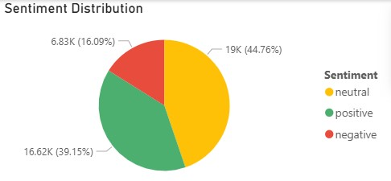
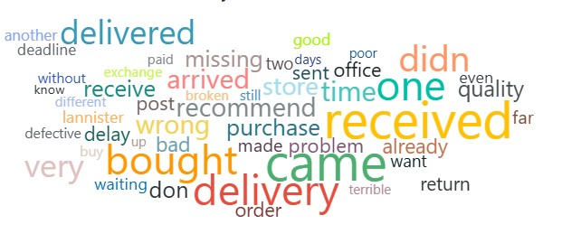
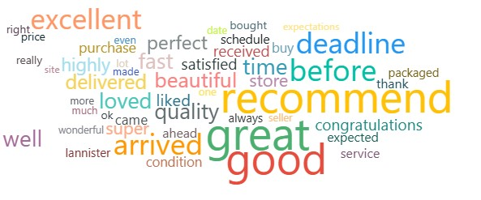

# Feedback Sentiment Analysis & Clustering - OLIST Brazilian e-Commerce
👉 [**Download the Power BI Report (.pbix)**](https://drive.google.com/uc?export=download&id=1lzJParmPO_Kn_BspM1aC1FAen83M2BkY)  
*A direct download link — no Google Drive preview.*

## Overview
Analysis of 42,000+ customer reviews from OLIST Brazilian e-Commerce platform to understand sentiment drivers and identify key factors affecting customer satisfaction.

## Key Findings
- **Sentiment Distribution**: 39% positive, 45% neutral, 16% negative (0.30 avg polarity)
- **Primary Pain Point**: Delivery delays dominate negative feedback
- **Satisfaction Drivers**: Fast delivery + high-quality products = strong loyalty & recommendations
- **Geographic Gaps**: São Paulo outperforms other cities; opportunity for regional standardization
  
### Sentiment Distribution

## Project Structure
- Data preprocessing and translation (Portuguese → English) with Azure Cognitive Services
- Sentiment classification and polarity scores using VADER
- Word frequency clustering analysis
- Power BI visualizations (word clouds, sentiment trends)

## Methodology
1. Loaded 42,000+ reviews from OLIST dataset
2. Translated reviews from Portuguese to English via Translator Azure Service's API
3. Calculate polarity scores of translated reviews with VADER
4. Extracted meaningful words using Python (removed stopwords, filtered 2+ characters)
5. Classified reviews into positive (>0.5), neutral (0-0.5), negative (<0)
6. Analyzed top 100 words per sentiment category
7. Created word cloud visualizations in Power BI

## Technologies Used
- Python (data cleaning, text analysis)
- VADER (sentiment analysis, polarity scores)
- Power BI (visualization)
- Pandas, Re, Collections libraries

## Key Insights
**Why Customers Are Mad:** Delivery delays, missing/defective items, poor quality

**Why Customers Are Happy:** Fast delivery, high-quality products, excellent service

## Recommendations
- Optimize delivery logistics
- Implement stricter quality control
- Implement monthly sentiment tracking to measure impact of improvements
- Use positive keywords as messaging for marketing campaigns and seller guidelines
